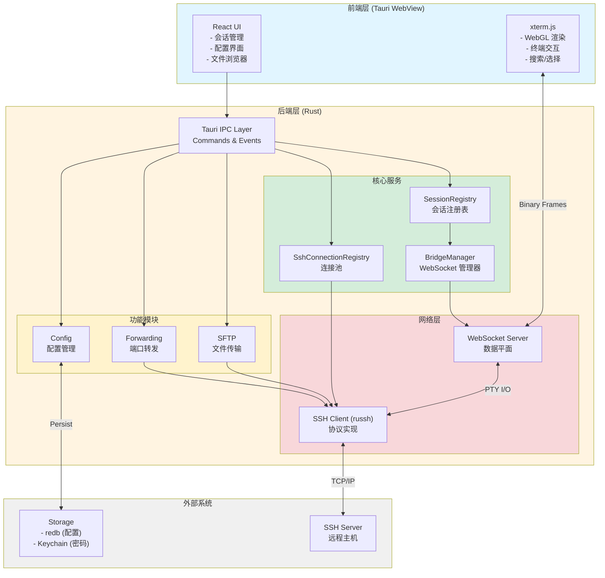
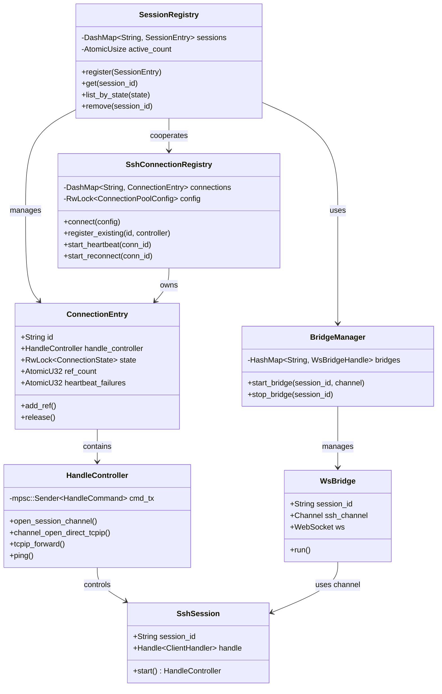
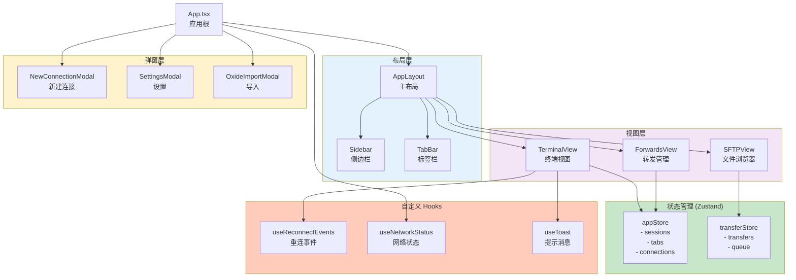
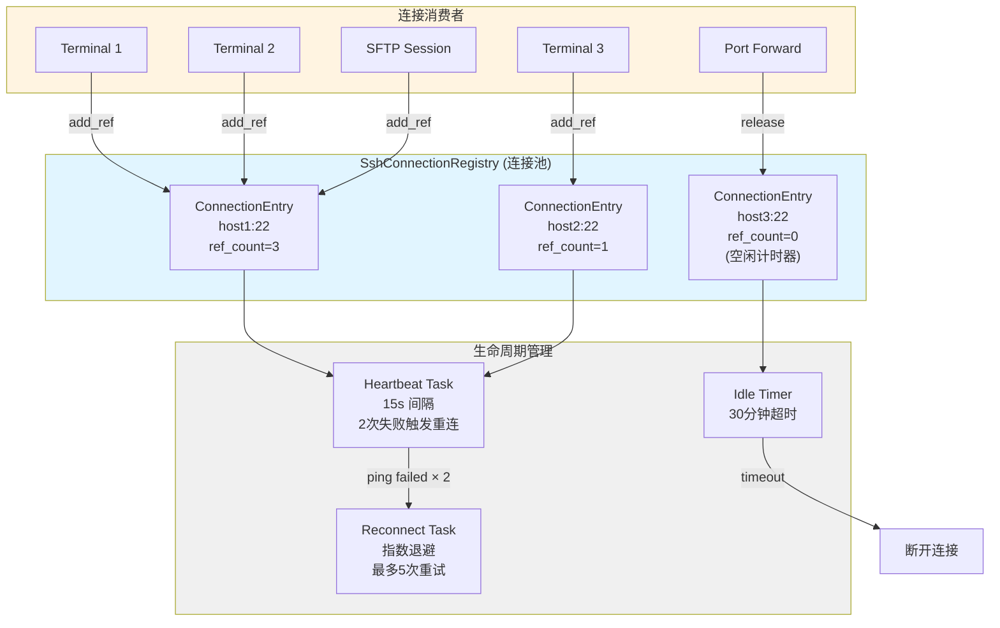
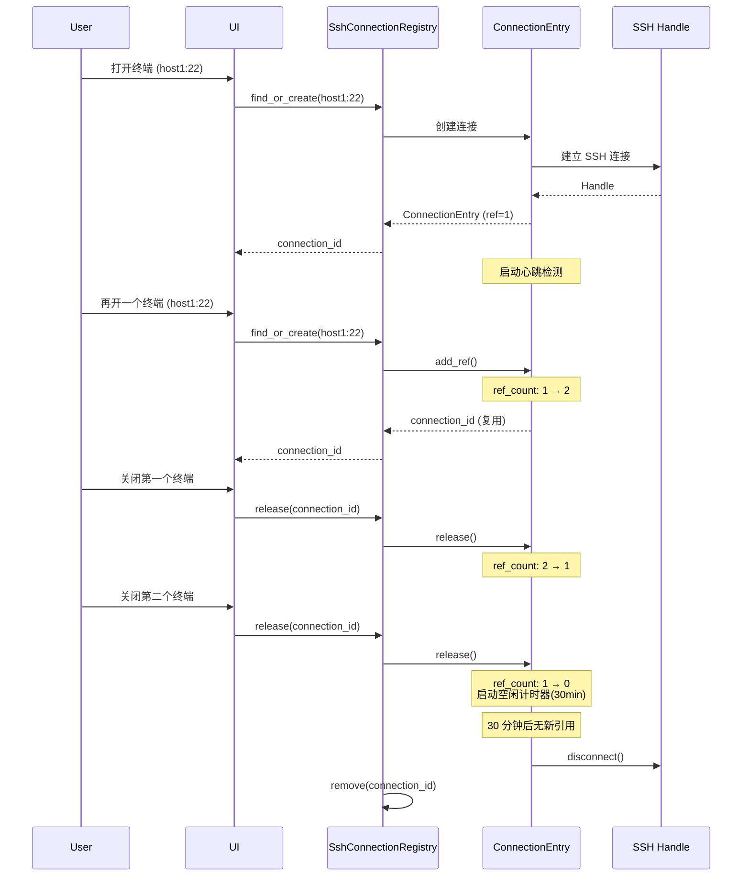
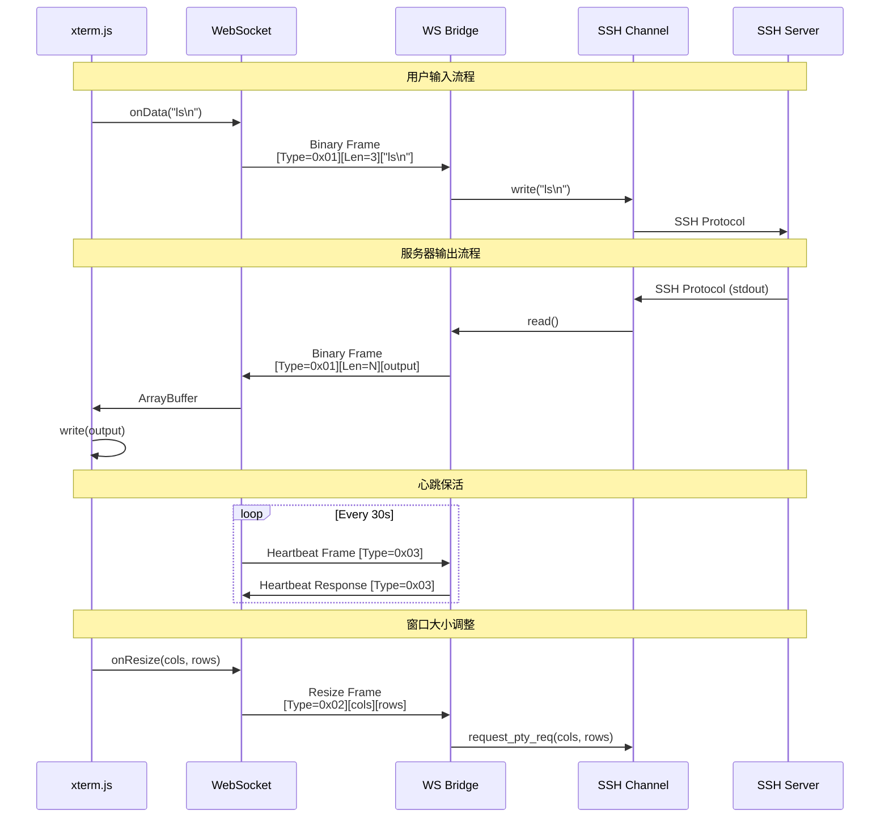
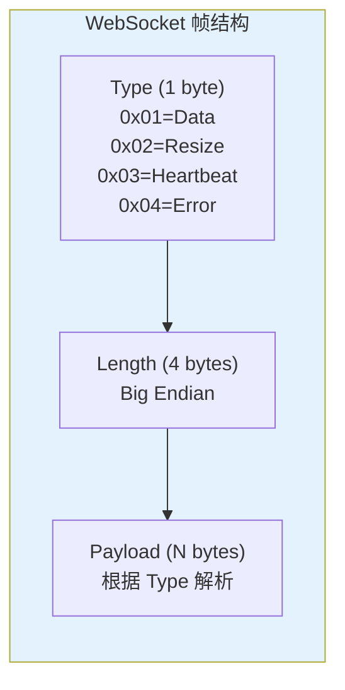
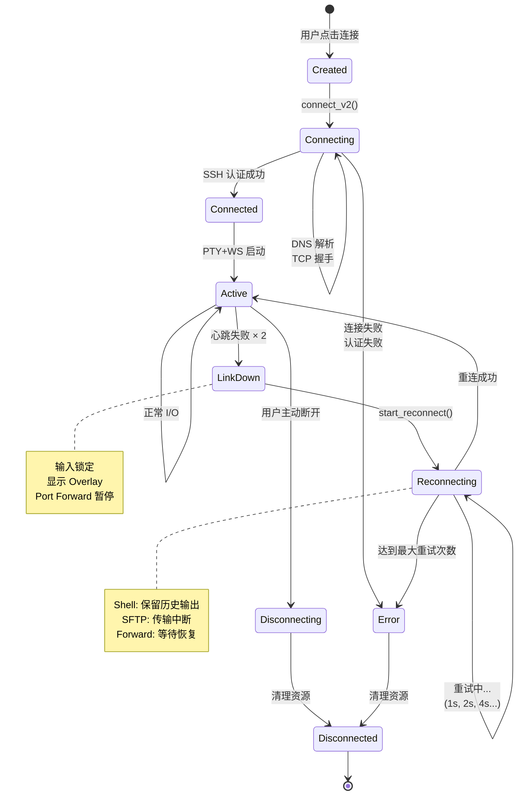
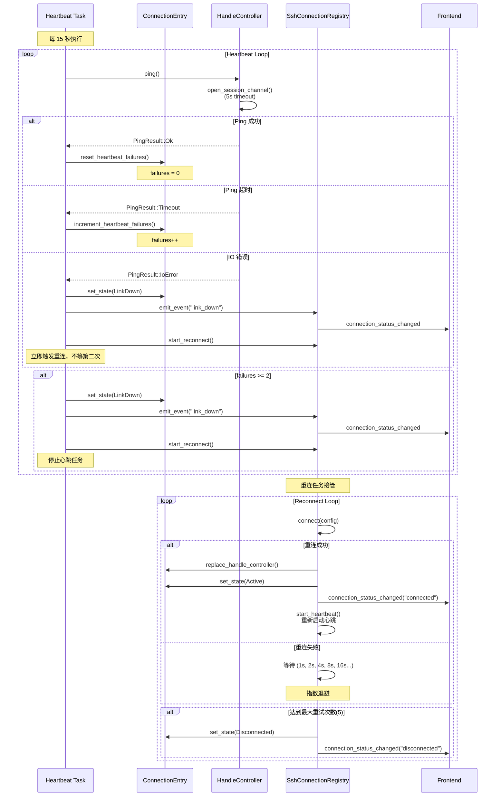
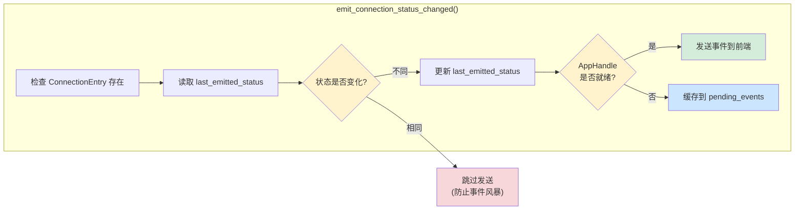

# OxideTerm 架构设计

> 本文档描述 OxideTerm 的系统架构、设计决策和核心组件。

## 目录

1. [设计理念](#设计理念)
2. [整体架构概览](#整体架构概览)
3. [双平面架构](#双平面架构)
4. [后端架构](#后端架构-rust)
5. [前端架构](#前端架构-react)
6. [SSH 连接池](#ssh-连接池)
7. [数据流与协议](#数据流与协议)
8. [会话生命周期](#会话生命周期)
9. [重连机制](#重连机制)
10. [安全设计](#安全设计)
11. [性能优化](#性能优化)

---

## 设计理念

### 核心原则

1. **性能优先** - 终端交互必须是极低延迟的，追求接近实时的响应速度
2. **安全至上** - 使用纯 Rust 实现 SSH，避免内存安全问题
3. **现代体验** - 提供与 VS Code / iTerm2 相当的用户体验
4. **可维护性** - 清晰的模块边界，易于扩展和测试

### 为什么选择 Tauri + Rust

| 对比项 | Electron | Tauri |
|--------|----------|-------|
| 包体积 | ~150MB | ~10MB |
| 内存占用 | ~300MB | ~50MB |
| 安全性 | Chromium 安全模型 | Rust 内存安全 + 沙箱 |
| SSH 实现 | 需要 Node.js 绑定 (ssh2) | 纯 Rust (russh) |

---

## 整体架构概览


```mermaid
graph TB
    subgraph Frontend["前端层 (Tauri WebView)"]
        UI["React UI<br/>- 会话管理<br/>- 配置界面<br/>- 文件浏览器"]
        Terminal["xterm.js<br/>- WebGL 渲染<br/>- 终端交互<br/>- 搜索/选择"]
    end
    
    subgraph Backend["后端层 (Rust)"]
        TauriIPC["Tauri IPC Layer<br/>Commands & Events"]
        
        subgraph Core["核心服务"]
            SessionMgr["SessionRegistry<br/>会话注册表"]
            ConnPool["SshConnectionRegistry<br/>连接池"]
            BridgeMgr["BridgeManager<br/>WebSocket 管理器"]
        end
        
        subgraph Features["功能模块"]
            SFTP["SFTP<br/>文件传输"]
            Forward["Forwarding<br/>端口转发"]
            Config["Config<br/>配置管理"]
        end
        
        subgraph Network["网络层"]
            WS["WebSocket Server<br/>数据平面"]
            SSH["SSH Client (russh)<br/>协议实现"]
        end
    end
    
    subgraph External["外部系统"]
        SSHServer["SSH Server<br/>远程主机"]
        Storage["Storage<br/>- redb (配置)<br/>- Keychain (密码)"]
    end
    
    UI --> TauriIPC
    Terminal <-->|Binary Frames| WS
    TauriIPC --> SessionMgr
    TauriIPC --> ConnPool
    TauriIPC --> SFTP
    TauriIPC --> Forward
    TauriIPC --> Config
    
    SessionMgr --> BridgeMgr
    BridgeMgr --> WS
    ConnPool --> SSH
    SFTP --> SSH
    Forward --> SSH
    
    WS <-->|PTY I/O| SSH
    SSH <-->|TCP/IP| SSHServer
    Config <-->|Persist| Storage
    
    style Frontend fill:#e1f5ff
    style Backend fill:#fff4e1
    style External fill:#f0f0f0
    style Core fill:#d4edda
    style Features fill:#fff3cd
    style Network fill:#f8d7da
```

---

## 双平面架构

OxideTerm 将通信分为两个平面：

### 数据平面 (Data Plane)

处理高频、极低延迟的终端 I/O：

```
┌─────────────┐     WebSocket (Binary)     ┌─────────────┐
│   xterm.js  │ ◄──────────────────────────► │  WS Bridge  │
│  (Frontend) │     每帧 < 1ms               │   (Rust)    │
└─────────────┘                             └──────┬──────┘
                                                   │
                                            ┌──────▼──────┐
                                            │ SSH Channel │
                                            │   (russh)   │
                                            └─────────────┘
```

**特点：**
- 二进制帧传输，无 JSON 序列化开销
- 绕过 Tauri IPC，直接 WebSocket 连接
- 心跳保活，30秒间隔，90秒超时断开
- 支持数据、调整大小、心跳等多种帧类型

### 控制平面 (Control Plane)

处理低频的管理操作：

```
┌─────────────┐     Tauri IPC (JSON)       ┌─────────────┐
│   React UI  │ ◄──────────────────────────► │  Commands   │
│  (Frontend) │     invoke('connect', ...)   │   (Rust)    │
└─────────────┘                             └─────────────┘
```

**特点：**
- 使用 Tauri Commands，类型安全
- 支持异步操作和错误处理
- 事件系统用于状态推送

---

## 后端架构 (Rust)

### 模块结构

```
src-tauri/src/
├── main.rs                 # 应用入口
├── lib.rs                  # 库入口，注册 Tauri 命令
│
├── ssh/                    # SSH 客户端核心
│   ├── mod.rs
│   ├── client.rs           # SSH 连接建立
│   ├── session.rs          # 会话管理 (Handle Owner Task)
│   ├── config.rs           # SSH Config 解析
│   ├── proxy.rs            # 代理跳板支持
│   ├── error.rs            # SSH 错误类型
│   ├── agent.rs            # SSH Agent (仅 UI/Types，核心待实现)
│   ├── keyboard_interactive.rs  # 2FA/KBI 认证
│   ├── known_hosts.rs      # 主机密钥验证
│   ├── handle_owner.rs     # Handle 控制器
│   └── connection_registry.rs  # 连接池
│
├── bridge/                 # WebSocket 桥接
│   ├── mod.rs
│   ├── server.rs           # WS 服务器
│   ├── protocol.rs         # 帧协议定义
│   └── manager.rs          # 连接管理
│
├── session/                # 会话管理
│   ├── mod.rs
│   ├── registry.rs         # 全局会话注册表
│   ├── state.rs            # 会话状态机
│   ├── health.rs           # 健康检查
│   ├── reconnect.rs        # 重连逻辑
│   ├── auto_reconnect.rs   # 自动重连任务
│   ├── auth.rs             # 认证流程
│   ├── events.rs           # 事件定义
│   ├── parser.rs           # 输出解析
│   ├── scroll_buffer.rs    # 滚动缓冲区
│   ├── search.rs           # 终端搜索
│   ├── tree.rs             # 会话树管理
│   ├── topology_graph.rs   # 拓扑图
│   └── types.rs            # 类型定义
│
├── sftp/                   # SFTP 实现
│   ├── mod.rs
│   ├── session.rs          # SFTP 会话
│   ├── types.rs            # 文件类型定义
│   └── error.rs            # SFTP 错误
│
├── forwarding/             # 端口转发
│   ├── mod.rs
│   ├── manager.rs          # 转发规则管理
│   ├── local.rs            # 本地转发 (-L)
│   ├── remote.rs           # 远程转发 (-R)
│   └── dynamic.rs          # 动态转发 (-D, SOCKS5)
│
├── config/                 # 配置管理
│   ├── mod.rs
│   ├── storage.rs          # 配置存储
│   ├── keychain.rs         # 系统密钥链
│   ├── ssh_config.rs       # ~/.ssh/config 解析
│   └── types.rs            # 配置类型
│
└── commands/               # Tauri 命令
    ├── mod.rs
    ├── connect_v2.rs       # 连接命令 (主要连接流程)
    ├── ssh.rs              # SSH 通用命令
    ├── config.rs           # 配置命令
    ├── sftp.rs             # SFTP 命令
    ├── forwarding.rs       # 转发命令
    ├── health.rs           # 健康检查命令
    ├── kbi.rs              # KBI/2FA 命令
    ├── network.rs          # 网络状态命令
    ├── oxide_export.rs     # .oxide 导出
    ├── oxide_import.rs     # .oxide 导入
    ├── scroll.rs           # 滚动缓冲区命令
    └── session_tree.rs     # 会话树命令
```

### 核心组件关系图


```mermaid
classDiagram
    class SessionRegistry {
        -DashMap~String, SessionEntry~ sessions
        -AtomicUsize active_count
        +register(SessionEntry)
        +get(session_id)
        +list_by_state(state)
        +remove(session_id)
    }
    
    class SshConnectionRegistry {
        -DashMap~String, ConnectionEntry~ connections
        -RwLock~ConnectionPoolConfig~ config
        +connect(config)
        +register_existing(id, controller)
        +start_heartbeat(conn_id)
        +start_reconnect(conn_id)
    }
    
    class ConnectionEntry {
        +String id
        +HandleController handle_controller
        +RwLock~ConnectionState~ state
        +AtomicU32 ref_count
        +AtomicU32 heartbeat_failures
        +add_ref()
        +release()
    }
    
    class HandleController {
        -mpsc::Sender~HandleCommand~ cmd_tx
        +open_session_channel()
        +channel_open_direct_tcpip()
        +tcpip_forward()
        +ping()
    }
    
    class SshSession {
        +String session_id
        +Handle~ClientHandler~ handle
        +start() HandleController
    }
    
    class BridgeManager {
        -HashMap~String, WsBridgeHandle~ bridges
        +start_bridge(session_id, channel)
        +stop_bridge(session_id)
    }
    
    class WsBridge {
        +String session_id
        +Channel ssh_channel
        +WebSocket ws
        +run()
    }
    
    SessionRegistry --> ConnectionEntry : manages
    SshConnectionRegistry --> ConnectionEntry : owns
    ConnectionEntry --> HandleController : contains
    HandleController --> SshSession : controls
    BridgeManager --> WsBridge : manages
    WsBridge --> SshSession : uses channel
    
    SessionRegistry --> SshConnectionRegistry : cooperates
    SessionRegistry --> BridgeManager : uses
```

---

## 前端架构 (React)

### 组件层次结构


```mermaid
graph TD
    App["App.tsx<br/>应用根"]
    
    subgraph Layout["布局层"]
        AppLayout["AppLayout<br/>主布局"]
        Sidebar["Sidebar<br/>侧边栏"]
        TabBar["TabBar<br/>标签栏"]
    end
    
    subgraph Views["视图层"]
        Terminal["TerminalView<br/>终端视图"]
        SFTP["SFTPView<br/>文件浏览器"]
        Forwards["ForwardsView<br/>转发管理"]
    end
    
    subgraph Modals["弹窗层"]
        NewConn["NewConnectionModal<br/>新建连接"]
        Settings["SettingsModal<br/>设置"]
        Import["OxideImportModal<br/>导入"]
    end
    
    subgraph State["状态管理 (Zustand)"]
        AppStore["appStore<br/>- sessions<br/>- tabs<br/>- connections"]
        TransferStore["transferStore<br/>- transfers<br/>- queue"]
    end
    
    subgraph Hooks["自定义 Hooks"]
        UseReconnect["useReconnectEvents<br/>重连事件"]
        UseNetwork["useNetworkStatus<br/>网络状态"]
        UseToast["useToast<br/>提示消息"]
    end
    
    App --> AppLayout
    AppLayout --> Sidebar
    AppLayout --> TabBar
    AppLayout --> Terminal
    AppLayout --> SFTP
    AppLayout --> Forwards
    
    App --> NewConn
    App --> Settings
    App --> Import
    
    Terminal --> AppStore
    SFTP --> TransferStore
    Forwards --> AppStore
    
    Terminal --> UseReconnect
    App --> UseNetwork
    Terminal --> UseToast
    
    style Layout fill:#e3f2fd
    style Views fill:#f3e5f5
    style Modals fill:#fff3cd
    style State fill:#c8e6c9
    style Hooks fill:#ffccbc
```

### 组件结构

#### SessionRegistry

全局会话注册表，管理所有活跃会话：

```rust
pub struct SessionRegistry {
    // session_id -> SessionInfo
    sessions: DashMap<String, SessionInfo>,
    // session_id -> HandleController (用于开启新 channel)
    controllers: DashMap<String, HandleController>,
}
```

#### HandleController

SSH 连接句柄控制器，允许在同一连接上开启多个 channel：

```rust
pub struct HandleController {
    tx: mpsc::Sender<HandleCommand>,
}

impl HandleController {
    // 开启新的 SSH channel (用于 SFTP、端口转发等)
    pub async fn open_session_channel(&self) -> Result<Channel>;
    pub async fn open_direct_tcpip(&self, host: &str, port: u16) -> Result<Channel>;
}
```

#### ForwardingManager

每个会话拥有独立的转发管理器：

```rust
pub struct ForwardingManager {
    session_id: String,
    forwards: HashMap<String, ForwardHandle>,
    stopped_forwards: HashMap<String, StoppedForward>,
    handle_controller: HandleController,
}
```

---

## 前端架构 (React)

### 组件结构

```
src/
├── App.tsx                 # 应用根组件
├── main.tsx                # React 入口
│
├── components/
│   ├── ui/                 # 原子组件 (Radix UI 封装)
│   │   ├── button.tsx
│   │   ├── dialog.tsx
│   │   ├── input.tsx
│   │   └── ...
│   │
│   ├── layout/             # 布局组件
│   │   ├── AppLayout.tsx   # 主布局
│   │   ├── Sidebar.tsx     # 侧边栏
│   │   └── TabBar.tsx      # 标签栏
│   │
│   ├── terminal/           # 终端组件
│   │   └── TerminalView.tsx
│   │
│   ├── sftp/               # SFTP 组件
│   │   ├── SFTPView.tsx    # 文件浏览器
│   │   └── TransferQueue.tsx
│   │
│   ├── forwards/           # 端口转发组件
│   │   └── ForwardsView.tsx
│   │
│   └── modals/             # 弹窗组件
│       ├── NewConnectionModal.tsx
│       └── SettingsModal.tsx
│
├── store/                  # Zustand 状态
│   ├── appStore.ts         # 应用状态
│   └── transferStore.ts    # 传输队列状态
│
├── lib/                    # 工具库
│   ├── api.ts              # Tauri API 封装
│   └── utils.ts            # 通用工具函数
│
├── hooks/                  # 自定义 Hooks
│   └── useToast.ts
│
└── types/                  # TypeScript 类型
    └── index.ts
```

### 状态管理

使用 Zustand 管理全局状态：

```typescript
interface AppState {
  // 会话列表
  sessions: SessionInfo[];
  
  // 标签页
  tabs: Tab[];
  activeTabId: string | null;
  
  // UI 状态
  sidebarCollapsed: boolean;
  activeModal: ModalType | null;
  
  // Actions
  addSession: (session: SessionInfo) => void;
  removeSession: (id: string) => void;
  setActiveTab: (id: string) => void;
  // ...
}
```

### 终端组件

TerminalView 使用 xterm.js 并通过 WebSocket 连接：

```typescript
const TerminalView = ({ sessionId, wsUrl }: Props) => {
  const termRef = useRef<Terminal>();
  const wsRef = useRef<WebSocket>();
  
  useEffect(() => {
    // 初始化 xterm.js
    const term = new Terminal({
      fontFamily: 'JetBrains Mono, monospace',
      fontSize: 14,
      theme: catppuccinMocha,
    });
    
    // 加载插件
    term.loadAddon(new WebglAddon());
    term.loadAddon(new FitAddon());
    
    // WebSocket 连接
    const ws = new WebSocket(wsUrl);
    ws.binaryType = 'arraybuffer';
    
    ws.onmessage = (e) => {
      // 解析帧协议，写入终端
      const frame = parseFrame(e.data);
      if (frame.type === FrameType.Data) {
        term.write(frame.payload);
      }
    };
    
    term.onData((data) => {
      // 发送用户输入
      ws.send(createDataFrame(data));
    });
    
    return () => ws.close();
  }, [wsUrl]);
};
```

---

## 会话生命周期

```
┌─────────────┐
│   Created   │  用户点击 "Connect"
└──────┬──────┘
       │ connect_v2()
       ▼
┌─────────────┐
│ Connecting  │  建立 TCP + SSH 握手
└──────┬──────┘
       │ 认证成功
       ▼
┌─────────────┐
│  Connected  │  开启 PTY channel + WS bridge
└──────┬──────┘
       │
       ├─────────────────────────────────┐
       │                                 │
       ▼                                 ▼
┌─────────────┐                   ┌─────────────┐
│   Active    │ ◄─── 心跳 ──────► │   Healthy   │
└──────┬──────┘                   └─────────────┘
       │
       │ 网络断开 / 用户关闭
       ▼
┌─────────────┐
│ Reconnecting│  (可选) 自动重连
└──────┬──────┘
       │ 重连失败 / 主动断开
       ▼
┌─────────────┐
│Disconnected │  清理资源
└─────────────┘
```

---

## 安全设计

### SSH 密钥处理

1. **密钥从不离开后端** - 私钥只在 Rust 代码中读取和使用
2. **内存中加密** - 密钥解密后使用 zeroize 安全清除
3. **系统密钥链** - 密码存储在 OS 安全存储中

### 密码存储

```rust
// macOS: Keychain Services
// Windows: Credential Manager  
// Linux: Secret Service (libsecret)

pub fn save_password(host: &str, username: &str, password: &str) -> Result<()> {
    let entry = keyring::Entry::new("oxideterm", &format!("{}@{}", username, host))?;
    entry.set_password(password)?;
    Ok(())
}
```

### 沙箱隔离

Tauri 2.0 提供细粒度的权限控制：

```json
// capabilities/default.json
{
  "permissions": [
    "core:default",
    "fs:default",
    "shell:allow-open"
  ]
}
```

---

## 性能优化

### 终端渲染

- WebGL 渲染替代 DOM 渲染，显著提升性能
- 使用 FitAddon 自适应容器大小
- 滚动缓冲区限制 (默认 10000 行)
- 支持终端内搜索 (`⌘F` / `Ctrl+F`)
- 后端滚动缓冲区优化（参见 BACKEND_SCROLL_BUFFER.md）

### 网络传输

- 二进制帧协议，无 Base64 编码
- 批量写入减少系统调用
- 心跳检测避免僵尸连接

### 内存管理

- Rust 后端零 GC 开销
- 会话资源及时清理
- 传输缓冲区池化复用
---

## 连接池与重连机制

### SSH 连接池架构

OxideTerm 实现了独立的 SSH 连接池，支持连接复用和自动重连：

```
┌─────────────────────────────────────────────────────┐
│              SshConnectionRegistry                  │
│  ┌──────────────────────────────────────────────┐   │
│  │  ConnectionEntry (host:port)                 │   │
│  │  ├── HandleController                         │   │
│  │  ├── ref_count (Terminal + SFTP + Forward)   │   │
│  │  ├── state (Active/LinkDown/Reconnecting)    │   │
│  │  ├── heartbeat_task (15s interval)           │   │
│  │  └── reconnect_task (exponential backoff)    │   │
│  └──────────────────────────────────────────────┘   │
└─────────────────────────────────────────────────────┘
           │
           ├───> Terminal 1 (shared connection)
           ├───> Terminal 2 (shared connection)
           ├───> SFTP Session
           └───> Port Forwards
```

**核心特性**：
- **连接复用**：多个终端会话共享同一 SSH 连接
- **空闲超时**：引用计数归零后 30 分钟自动断开
- **心跳检测**：15s 间隔，2 次失败触发重连
- **状态守卫**：避免重复发送相同状态事件

### 心跳与重连流程

```
┌──────────┐   Heartbeat (15s)   ┌───────────┐
│  Active  │ ────────────────────>│  Ping OK  │
└──────────┘                      └───────────┘
     │                                   
     │ Ping timeout × 2                  
     ▼                                   
┌──────────┐                             
│ LinkDown │                             
└────┬─────┘                             
     │                                   
     │ start_reconnect()                 
     ▼                                   
┌──────────────┐   Retry 1 (1s)         
│ Reconnecting │ ──────────────> Connect SSH
└──────────────┘                         │
     │                                   │
     │ Success                           │ Fail
     │                                   ▼
     │                           Retry 2 (2s)
     │                                   │
     ▼                                   │ Fail
┌──────────┐                            ▼
│  Active  │                    Retry 3 (4s)...
└──────────┘                    (exponential backoff)
```

**重连行为**：
- **Terminal**: 输入锁定，显示 Input Lock Overlay，保留历史输出
- **SFTP**: 传输中断，标记为 error，支持断点续传（计划中）
- **Port Forward**: 自动恢复所有转发规则

### 事件系统

连接状态变更通过 Tauri 事件广播到前端：

```typescript
// 前端监听连接状态
listen('connection_status_changed', (event) => {
  const { connection_id, status } = event.payload;
  // status: 'active' | 'link_down' | 'reconnecting' | 'connected' | 'disconnected'
});
```

**状态守卫**：只有状态真正变化时才发送事件，避免事件风暴
**AppHandle 缓存**：启动时 AppHandle 未就绪的事件会被缓存，就绪后立即发送

---

## SSH 连接池

### 连接池架构图


```mermaid
graph TB
    subgraph ConnectionPool["SshConnectionRegistry (连接池)"]
        Entry1["ConnectionEntry<br/>host1:22<br/>ref_count=3"]
        Entry2["ConnectionEntry<br/>host2:22<br/>ref_count=1"]
        Entry3["ConnectionEntry<br/>host3:22<br/>ref_count=0<br/>(空闲计时器)"]
    end
    
    subgraph Consumers["连接消费者"]
        T1["Terminal 1"]
        T2["Terminal 2"]
        T3["Terminal 3"]
        S1["SFTP Session"]
        F1["Port Forward"]
    end
    
    subgraph Lifecycle["生命周期管理"]
        HB["Heartbeat Task<br/>15s 间隔<br/>2次失败触发重连"]
        RC["Reconnect Task<br/>指数退避<br/>最多5次重试"]
        IT["Idle Timer<br/>30分钟超时"]
    end
    
    T1 -->|add_ref| Entry1
    T2 -->|add_ref| Entry1
    S1 -->|add_ref| Entry1
    T3 -->|add_ref| Entry2
    F1 -->|release| Entry3
    
    Entry1 --> HB
    Entry2 --> HB
    Entry3 --> IT
    
    HB -->|ping failed × 2| RC
    IT -->|timeout| Disconnect["断开连接"]
    
    style ConnectionPool fill:#e1f5ff
    style Consumers fill:#fff4e1
    style Lifecycle fill:#f0f0f0
```

### 连接复用流程


```mermaid
sequenceDiagram
    participant User
    participant UI
    participant Registry as SshConnectionRegistry
    participant Conn as ConnectionEntry
    participant SSH as SSH Handle
    
    User->>UI: 打开终端 (host1:22)
    UI->>Registry: find_or_create(host1:22)
    Registry->>Conn: 创建连接
    Conn->>SSH: 建立 SSH 连接
    SSH-->>Conn: Handle
    Conn-->>Registry: ConnectionEntry (ref=1)
    Registry-->>UI: connection_id
    
    Note over Conn: 启动心跳检测
    
    User->>UI: 再开一个终端 (host1:22)
    UI->>Registry: find_or_create(host1:22)
    Registry->>Conn: add_ref()
    Note over Conn: ref_count: 1 → 2
    Conn-->>Registry: connection_id (复用)
    Registry-->>UI: connection_id
    
    User->>UI: 关闭第一个终端
    UI->>Registry: release(connection_id)
    Registry->>Conn: release()
    Note over Conn: ref_count: 2 → 1
    
    User->>UI: 关闭第二个终端
    UI->>Registry: release(connection_id)
    Registry->>Conn: release()
    Note over Conn: ref_count: 1 → 0<br/>启动空闲计时器(30min)
    
    Note over Conn: 30 分钟后无新引用
    Conn->>SSH: disconnect()
    Registry->>Registry: remove(connection_id)
```

---

## 数据流与协议

### WebSocket 数据流


```mermaid
sequenceDiagram
    participant XTerm as xterm.js
    participant WS as WebSocket
    participant Bridge as WS Bridge
    participant Channel as SSH Channel
    participant Server as SSH Server
    
    Note over XTerm,Server: 用户输入流程
    XTerm->>WS: onData("ls\n")
    WS->>Bridge: Binary Frame<br/>[Type=0x01][Len=3]["ls\n"]
    Bridge->>Channel: write("ls\n")
    Channel->>Server: SSH Protocol
    
    Note over XTerm,Server: 服务器输出流程
    Server->>Channel: SSH Protocol (stdout)
    Channel->>Bridge: read()
    Bridge->>WS: Binary Frame<br/>[Type=0x01][Len=N][output]
    WS->>XTerm: ArrayBuffer
    XTerm->>XTerm: write(output)
    
    Note over XTerm,Server: 心跳保活
    loop Every 30s
        WS->>Bridge: Heartbeat Frame [Type=0x03]
        Bridge->>WS: Heartbeat Response [Type=0x03]
    end
    
    Note over XTerm,Server: 窗口大小调整
    XTerm->>WS: onResize(cols, rows)
    WS->>Bridge: Resize Frame<br/>[Type=0x02][cols][rows]
    Bridge->>Channel: request_pty_req(cols, rows)
```

### 帧协议定义


```mermaid
graph LR
    subgraph Frame["WebSocket 帧结构"]
        Type["Type (1 byte)<br/>0x01=Data<br/>0x02=Resize<br/>0x03=Heartbeat<br/>0x04=Error"]
        Length["Length (4 bytes)<br/>Big Endian"]
        Payload["Payload (N bytes)<br/>根据 Type 解析"]
    end
    
    Type --> Length
    Length --> Payload
    
    style Frame fill:#e3f2fd
```

---

## 会话生命周期

### 状态机流程


```mermaid
stateDiagram-v2
    [*] --> Created: 用户点击连接
    
    Created --> Connecting: connect_v2()
    Connecting --> Connecting: DNS 解析<br/>TCP 握手
    
    Connecting --> Connected: SSH 认证成功
    Connecting --> Error: 连接失败<br/>认证失败
    
    Connected --> Active: PTY+WS 启动
    Active --> Active: 正常 I/O
    
    Active --> LinkDown: 心跳失败 × 2
    LinkDown --> Reconnecting: start_reconnect()
    
    Reconnecting --> Reconnecting: 重试中...<br/>(1s, 2s, 4s...)
    Reconnecting --> Active: 重连成功
    Reconnecting --> Error: 达到最大重试次数
    
    Active --> Disconnecting: 用户主动断开
    Disconnecting --> Disconnected: 清理资源
    
    Error --> Disconnected: 清理资源
    Disconnected --> [*]
    
    note right of LinkDown
        输入锁定
        显示 Overlay
        Port Forward 暂停
    end note
    
    note right of Reconnecting
        Shell: 保留历史输出
        SFTP: 传输中断
        Forward: 等待恢复
    end note
```

---

## 重连机制

### 心跳检测与重连


```mermaid
sequenceDiagram
    participant HB as Heartbeat Task
    participant Conn as ConnectionEntry
    participant HC as HandleController
    participant Reg as SshConnectionRegistry
    participant UI as Frontend
    
    Note over HB: 每 15 秒执行
    
    loop Heartbeat Loop
        HB->>HC: ping()
        HC->>HC: open_session_channel()<br/>(5s timeout)
        
        alt Ping 成功
            HC-->>HB: PingResult::Ok
            HB->>Conn: reset_heartbeat_failures()
            Note over Conn: failures = 0
        else Ping 超时
            HC-->>HB: PingResult::Timeout
            HB->>Conn: increment_heartbeat_failures()
            Note over Conn: failures++
        else IO 错误
            HC-->>HB: PingResult::IoError
            HB->>Conn: set_state(LinkDown)
            HB->>Reg: emit_event("link_down")
            Reg->>UI: connection_status_changed
            HB->>Reg: start_reconnect()
            Note over HB: 立即触发重连，不等第二次
        end
        
        alt failures >= 2
            HB->>Conn: set_state(LinkDown)
            HB->>Reg: emit_event("link_down")
            Reg->>UI: connection_status_changed
            HB->>Reg: start_reconnect()
            Note over HB: 停止心跳任务
        end
    end
    
    Note over Reg: 重连任务接管
    
    loop Reconnect Loop
        Reg->>Reg: connect(config)
        
        alt 重连成功
            Reg->>Conn: replace_handle_controller()
            Reg->>Conn: set_state(Active)
            Reg->>UI: connection_status_changed("connected")
            Reg->>Reg: start_heartbeat()<br/>重新启动心跳
        else 重连失败
            Reg->>Reg: 等待 (1s, 2s, 4s, 8s, 16s...)
            Note over Reg: 指数退避
        end
        
        alt 达到最大重试次数(5)
            Reg->>Conn: set_state(Disconnected)
            Reg->>UI: connection_status_changed("disconnected")
        end
    end
```

### 状态守卫机制


```mermaid
graph LR
    subgraph EventEmit["emit_connection_status_changed()"]
        CheckConn["检查 ConnectionEntry 存在"]
        ReadLast["读取 last_emitted_status"]
        Compare{"状态是否变化?"}
        UpdateLast["更新 last_emitted_status"]
        CheckHandle{"AppHandle<br/>是否就绪?"}
        EmitEvent["发送事件到前端"]
        CacheEvent["缓存到 pending_events"]
    end
    
    CheckConn --> ReadLast
    ReadLast --> Compare
    Compare -->|相同| Skip["跳过发送<br/>(防止事件风暴)"]
    Compare -->|不同| UpdateLast
    UpdateLast --> CheckHandle
    CheckHandle -->|是| EmitEvent
    CheckHandle -->|否| CacheEvent
    
    style Compare fill:#fff3cd
    style CheckHandle fill:#fff3cd
    style Skip fill:#f8d7da
    style EmitEvent fill:#d4edda
    style CacheEvent fill:#cce5ff
```

---

*本文档持续更新，反映最新架构变更*