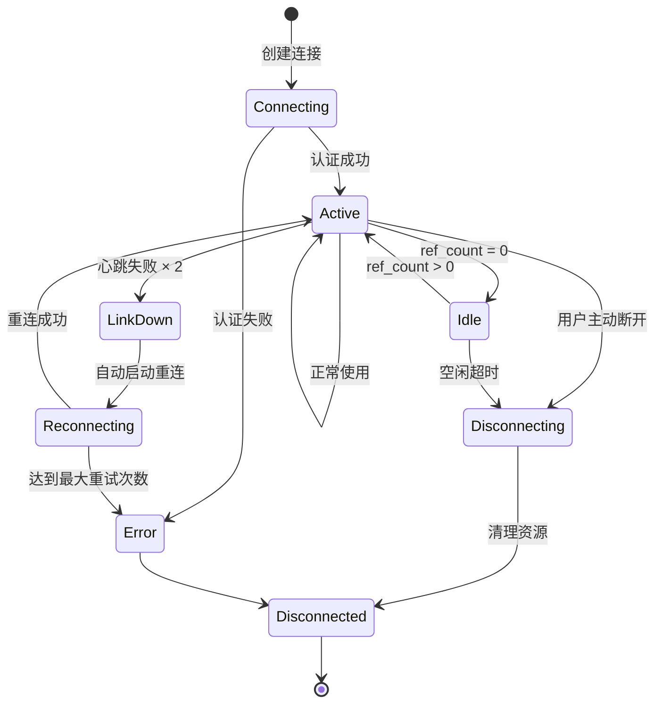
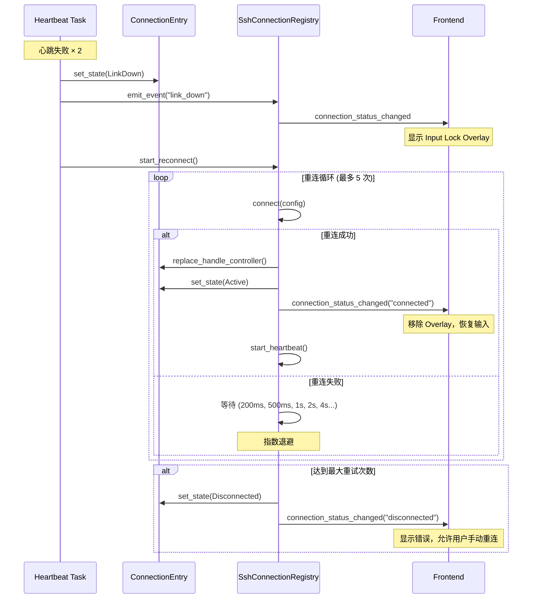

# SSH 连接池 - 智能连接复用与自动重连

> 通过引用计数和心跳机制实现的高效 SSH 连接池，支持多会话共享、自动重连和空闲管理。

## 🎯 核心概念

SSH 连接池是 OxideTerm 的核心基础设施，它允许多个终端窗口、SFTP 会话和端口转发规则共享同一个物理 SSH 连接。

### 为什么需要连接池？

**传统方式的问题**：
- 每个终端窗口建立独立的 SSH 连接
- 重复的握手和认证过程（浪费时间和资源）
- 服务器可能限制同时连接数
- 网络抖动时所有连接同时断开

**连接池的优势**：
- ✅ **连接复用**：一次握手，多个会话共享
- ✅ **智能重连**：断线后自动重建，对用户透明
- ✅ **资源高效**：减少服务器负载和网络开销
- ✅ **优雅降级**：心跳失败时进入保护模式

---

## 🏗️ 架构概览

```
┌──────────────────────────────────────────────────────────────┐
│  SshConnectionRegistry (连接池)                              │
│  ┌────────────────────────────────────────────────────────┐  │
│  │  ConnectionEntry (单个 SSH 连接)                       │  │
│  │  ├── HandleController (克隆给消费者)                   │  │
│  │  ├── config: SessionConfig                             │  │
│  │  ├── ref_count: AtomicU32 (引用计数)                   │  │
│  │  ├── state: ConnectionState                            │  │
│  │  ├── heartbeat_task: 心跳检测 (15s 间隔)               │  │
│  │  ├── reconnect_task: 重连任务 (指数退避)               │  │
│  │  └── idle_timer: 空闲超时 (默认 30 分钟)               │  │
│  └────────────────────────────────────────────────────────┘  │
└──────────────────────────────────────────────────────────────┘
          │
          │  HandleController (clone)
          │
    ┌─────┴─────┬─────────────┬─────────────┐
    ▼           ▼             ▼             ▼
Terminal   Terminal      SFTP       Port Forward
 Tab 1      Tab 2
```

### 核心组件

| 组件 | 职责 |
|------|------|
| **SshConnectionRegistry** | 全局连接池，管理所有 SSH 连接 |
| **ConnectionEntry** | 单个 SSH 连接的封装，包含状态和元数据 |
| **HandleController** | 可克隆的句柄，用于在连接上开启新 channel |
| **ref_count** | 原子引用计数，追踪连接的使用者数量 |
| **heartbeat_task** | 心跳检测任务，监控连接健康状况 |
| **reconnect_task** | 重连任务，断线后自动恢复 |
| **idle_timer** | 空闲计时器，无使用者时自动断开 |

---

## 📊 连接状态机



### 状态说明

| 状态 | 含义 | ref_count |
|------|------|-----------|
| **Connecting** | 正在建立 TCP + SSH 握手 | 0 |
| **Active** | 已连接，有会话在使用 | > 0 |
| **Idle** | 已连接，无使用者，等待超时 | 0 |
| **LinkDown** | 心跳失败，链路断开 | >= 0 |
| **Reconnecting** | 正在重连 | >= 0 |
| **Disconnecting** | 正在断开连接 | 0 |
| **Disconnected** | 已断开 | 0 |
| **Error** | 连接错误 | 0 |

---

## 🔄 引用计数机制

### 工作原理

每个连接维护一个原子引用计数器（`AtomicU32`），记录有多少个"使用者"：

```
连接创建时：ref_count = 0
├── Terminal 1 打开    → ref_count++  (0 → 1)
├── Terminal 2 打开    → ref_count++  (1 → 2)
├── SFTP 会话打开      → ref_count++  (2 → 3)
├── 端口转发规则添加   → ref_count++  (3 → 4)
│
├── Terminal 1 关闭    → ref_count--  (4 → 3)
├── Terminal 2 关闭    → ref_count--  (3 → 2)
├── SFTP 会话关闭      → ref_count--  (2 → 1)
└── 端口转发规则删除   → ref_count--  (1 → 0)
     │
     └── 归零后触发：
         - state: Active → Idle
         - 启动空闲计时器（默认 30 分钟）
```

### 消费者类型

| 消费者 | add_ref | release |
|--------|---------|---------|
| **Terminal 会话** | 创建终端时 | 关闭终端时 |
| **SFTP 会话** | 打开文件浏览器时 | 关闭文件浏览器时 |
| **端口转发** | 添加转发规则时 | 删除转发规则时 |

---

## 💓 心跳检测机制

### 配置参数

```rust
心跳间隔 (HEARTBEAT_INTERVAL):    15 秒
失败阈值 (HEARTBEAT_FAIL_THRESHOLD): 2 次
总检测时间：15s × 2 = 30 秒内必触发重连
```

### 心跳流程

```
每 15 秒执行一次心跳检测：
┌────────────────────────────────────────────────────┐
│  1. HandleController.ping()                        │
│     └── 尝试打开一个 SSH session_channel (5s超时) │
│                                                    │
│  2. 根据结果分类：                                 │
│     ├── PingResult::Ok                             │
│     │   → reset_heartbeat_failures()               │
│     │   → failures = 0                             │
│     │                                               │
│     ├── PingResult::Timeout                        │
│     │   → increment_heartbeat_failures()           │
│     │   → failures++                               │
│     │   → 如果 failures >= 2：触发 LinkDown        │
│     │                                               │
│     └── PingResult::IoError                        │
│         → 立即标记为 LinkDown                      │
│         → 立即启动重连（不等第二次）               │
└────────────────────────────────────────────────────┘
```

### 心跳检测的好处

- **早期发现问题**：不等用户输入才发现连接断开
- **主动保活**：防止 NAT 超时或防火墙断连
- **透明恢复**：用户无感知的自动重连

---

## 🔁 自动重连机制

### 重连策略

**指数退避 (Exponential Backoff)**：

```
首次重连：200ms  (快速首跳，瞬断场景近乎无感)
第 2 次： 500ms
第 3 次： 1s
第 4 次： 2s
第 5 次： 4s
...
最大间隔：60s
最大次数：5 次（普通模式）
```

### 重连流程



### 重连行为

| 组件 | LinkDown 行为 | Reconnecting 行为 | Connected 后 |
|------|---------------|-------------------|--------------|
| **Terminal** | 输入锁定，显示 Input Lock Overlay | 保留历史输出 | 移除锁定，恢复输入 |
| **SFTP** | 传输中断，标记为 error | 等待重连 | 自动刷新文件列表 |
| **Port Forward** | 转发暂停 | 等待恢复 | 自动恢复所有转发规则 |

---

## ⏱️ 空闲超时机制

### 配置参数

```rust
默认空闲超时：30 分钟 (可配置)
keep_alive 标志：忽略空闲超时
```

### 空闲超时流程

```
ref_count 归零时：
├── state: Active → Idle
├── 启动空闲计时器（30 分钟倒计时）
│
│  ┌─────────────────────────────────────┐
│  │  期间如有新使用者：                 │
│  │  ├── 取消空闲计时器                 │
│  │  ├── state: Idle → Active           │
│  │  └── ref_count++                    │
│  └─────────────────────────────────────┘
│
└── 30 分钟后无新引用：
    ├── 取消心跳任务
    ├── 关闭 SSH 连接
    ├── state: Idle → Disconnected
    └── 从连接池中移除
```

### keep_alive 模式

如果 `keep_alive = true`：
- ❌ 不启动空闲计时器
- ✅ 即使 ref_count = 0 也保持连接
- ✅ 心跳继续运行，保持连接活跃
- 用途：需要长期保持连接的场景（例如：自动化脚本）

---

## 📈 连接池统计

### 监控指标

连接池提供实时统计信息，可用于监控面板：

```typescript
interface ConnectionPoolStats {
  totalConnections: number;         // 总连接数
  activeConnections: number;         // 活跃连接数 (有使用者)
  idleConnections: number;           // 空闲连接数 (无使用者，等待超时)
  reconnectingConnections: number;   // 重连中的连接数
  linkDownConnections: number;       // 链路断开的连接数
  totalTerminals: number;            // 总终端数
  totalSftpSessions: number;         // 总 SFTP 会话数
  totalForwards: number;             // 总端口转发数
  totalRefCount: number;             // 总引用计数
  poolCapacity: number;              // 连接池容量 (0 = 无限制)
  idleTimeoutSecs: number;           // 空闲超时时间 (秒)
}
```

### 使用示例

```bash
# 示例输出
总连接数: 5
  ├── 活跃: 3
  ├── 空闲: 1
  ├── 重连中: 1
  └── 链路断开: 0

总使用者: 8
  ├── 终端: 5
  ├── SFTP: 2
  └── 端口转发: 1

总引用计数: 8
```

---

## 🔒 线程安全

### 原子操作

连接池使用无锁数据结构确保线程安全：

| 字段 | 类型 | 用途 |
|------|------|------|
| `ref_count` | `AtomicU32` | 引用计数 |
| `last_active` | `AtomicU64` | 最后活动时间戳 |
| `heartbeat_failures` | `AtomicU32` | 心跳失败计数 |
| `reconnect_attempts` | `AtomicU32` | 重连尝试次数 |
| `is_reconnecting` | `AtomicBool` | 重连标志 |
| `current_attempt_id` | `AtomicU64` | 重连任务 ID（防止旧任务覆盖新任务） |

### 锁保护

对于需要互斥的操作，使用 Tokio 异步锁：

| 字段 | 类型 | 保护内容 |
|------|------|---------|
| `state` | `RwLock<ConnectionState>` | 连接状态 |
| `keep_alive` | `RwLock<bool>` | keep_alive 标志 |
| `terminal_ids` | `RwLock<Vec<String>>` | 关联的终端 ID |
| `sftp_session_id` | `RwLock<Option<String>>` | 关联的 SFTP 会话 ID |
| `forward_ids` | `RwLock<Vec<String>>` | 关联的转发 ID |
| `idle_timer` | `Mutex<Option<JoinHandle>>` | 空闲计时器句柄 |
| `heartbeat_task` | `Mutex<Option<JoinHandle>>` | 心跳任务句柄 |
| `reconnect_task` | `Mutex<Option<JoinHandle>>` | 重连任务句柄 |

---

## 🎛️ 配置选项

### 连接池配置

```rust
pub struct ConnectionPoolConfig {
    /// 空闲超时时间（秒）
    idle_timeout_secs: u64,  // 默认: 1800 (30 分钟)
    
    /// 最大连接数（0 = 无限制）
    max_connections: usize,  // 默认: 0
    
    /// 应用退出时保护连接（graceful shutdown）
    protect_on_exit: bool,   // 默认: true
}
```

### 更新配置

```rust
// 设置自定义配置
let config = ConnectionPoolConfig {
    idle_timeout_secs: 3600,  // 1 小时
    max_connections: 10,       // 最多 10 个连接
    protect_on_exit: true,
};

registry.set_config(config).await;
```

---

## ⚡ 性能优化

### 1. DashMap 无锁并发

```rust
// 使用 DashMap 替代 RwLock<HashMap>
connections: DashMap<String, Arc<ConnectionEntry>>
```

**优势**：
- ✅ 读操作无需全局锁
- ✅ 写操作仅锁定单个分片
- ✅ 高并发场景性能优秀

### 2. 原子操作

```rust
// 无锁引用计数
ref_count.fetch_add(1, Ordering::SeqCst);
ref_count.fetch_sub(1, Ordering::SeqCst);
```

**优势**：
- ✅ 无锁争用
- ✅ CPU 原子指令，极低开销

### 3. 异步任务隔离

```rust
// 心跳任务独立运行
tokio::spawn(async move { /* heartbeat loop */ });

// 重连任务独立运行
tokio::spawn(async move { /* reconnect loop */ });
```

**优势**：
- ✅ 不阻塞主事件循环
- ✅ 任务可独立取消

---

## 🛡️ 错误处理

### 错误类型

```rust
pub enum ConnectionRegistryError {
    NotFound(String),                      // 连接不存在
    LimitReached { current: usize, max: usize },  // 达到连接数上限
    ConnectionFailed(String),              // 连接失败
    AlreadyDisconnected,                   // 已断开
    InvalidState(String),                  // 无效状态转换
}
```

### 错误恢复策略

| 错误类型 | 处理方式 |
|---------|---------|
| **网络断开** | 自动重连（最多 5 次） |
| **认证失败** | 标记为 Error，通知用户 |
| **连接数超限** | 拒绝新连接，提示用户 |
| **心跳超时** | 标记为 LinkDown，启动重连 |

---

## 📚 使用示例

### 创建连接

```rust
let config = SessionConfig::with_password(
    "prod.example.com",
    22,
    "admin",
    "password123"
);

let connection_id = registry.connect(config).await?;
```

### 获取句柄并使用

```rust
// 获取连接
let entry = registry.get(&connection_id)?;

// 增加引用计数
entry.add_ref();

// 克隆 HandleController
let handle = entry.handle_controller.clone();

// 打开新 channel
let channel = handle.open_session_channel().await?;

// 使用完毕后释放
entry.release();
```

### 查看统计信息

```rust
let stats = registry.get_stats().await;
println!("总连接数: {}", stats.total_connections);
println!("活跃连接数: {}", stats.active_connections);
println!("总引用计数: {}", stats.total_ref_count);
```

---

## 🔧 故障排查

### Q: 连接总是在 30 分钟后断开？

A: 这是正常的空闲超时行为。如果需要保持连接：
1. 设置 `keep_alive = true`
2. 或增大 `idle_timeout_secs` 配置

### Q: 心跳频繁失败但网络正常？

A: 可能的原因：
- 服务器限制了并发 session 数
- 防火墙阻止了某些端口
- 服务器负载过高

建议：增大心跳间隔或禁用心跳

### Q: 重连总是失败？

A: 检查：
- 认证信息是否正确（密钥是否过期）
- 网络是否稳定
- 服务器是否在线
- 查看详细错误日志

---

*文档版本: v1.1.0 | 最后更新: 2026-01-19*
