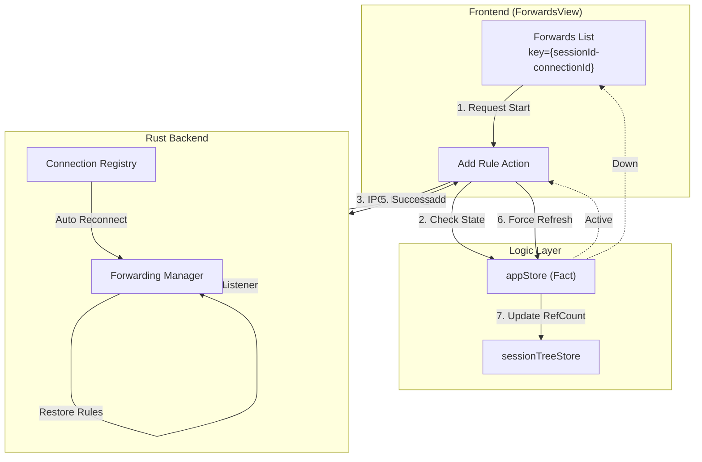
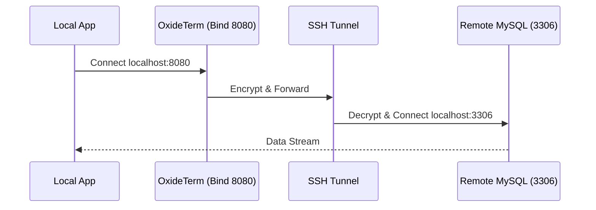
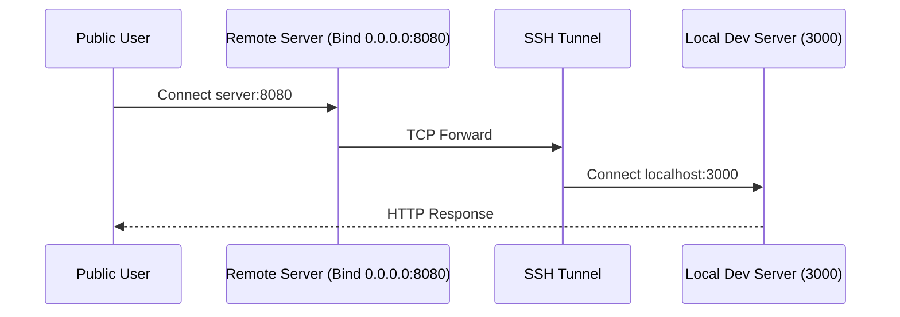

# OxideTerm 端口转发功能文档

> 依托于 v1.4.0 核心架构的智能端口转发系统，支持自愈与状态同步。

## 📖 概述

OxideTerm 提供企业级的 SSH 端口转发功能，不仅支持标准的本地、远程和动态转发，还集成了 v1.4.0 的 **自动重连自愈** 和 **强一致性同步** 机制，确保隧道在网络波动时依然稳定可靠。

### 核心特性 (v1.4.0)

| 特性 | 说明 |
|------|------|
| **Link Resilience** | SSH 连接断开重连后，自动恢复所有转发规则 |
| **强一致性同步** | 规则变更强制触发 `AppStore` 刷新，确保连接引用计数准确 |
| **实时流量监控** | 基于 Tauri Event 的实时流量统计 (Bytes In/Out) |
| **状态门禁** | UI 操作严格受连接状态 (`Active`) 保护 |

---

## 🏗️ 架构与数据流 (v1.4.0)

端口转发模块深度集成了双 Store 架构：



### Key-Driven 重置机制

`ForwardsView` 组件被包裹在 `IdeWorkspace` 或作为独立 Tab 存在，其生命周期与物理连接绑定：

```tsx
// ForwardsView.tsx
// 当重连发生 (connectionId 改变)，组件自动重置
// 触发 useEffect 重新拉取当前活跃的转发规则
useEffect(() => {
  if (connectionId && status === 'active') {
    refreshRules();
  }
}, [connectionId, status]);
```

---

## 转发类型

### 1. 本地转发 (Local Forwarding)

**场景**: 访问远程数据库或内部 Web 服务。



**配置**:
- **Source**: `localhost:8080`
- **Destination**: `localhost:3306`

### 2. 远程转发 (Remote Forwarding)

**场景**: 将本地开发服务器暴露给公网/队友访问。



**配置**:
- **Source**: `0.0.0.0:8080` (注意服务器需开启 `GatewayPorts yes`)
- **Destination**: `localhost:3000`

### 3. 动态转发 (SOCKS5 Proxy)

**场景**: 全局代理或特定网络环境访问。

**配置**:
- **Bind**: `localhost:1080`

---

## 界面交互

### 流量监控与状态同步

v1.4.0 引入了精确的流量统计和状态反馈：

```
┌─────────────────────────────────────────────────────────────┐
│ Port Forwards - prod-db (Active)               [+ New Rule] │
├─────────────────────────────────────────────────────────────┤
│                                                             │
│ ┌─────────────────────────────────────────────────────────┐ │
│ │ 🟢 Local: 8080 -> 3306                                  │ │
│ │ 3 active connections                                    │ │
│ │ Traffic: ↑ 1.2 MB  ↓ 45.8 MB                            │ │
│ │ [Stop] [Edit] [Delete]                                  │ │
│ └─────────────────────────────────────────────────────────┘ │
│                                                             │
│ ┌─────────────────────────────────────────────────────────┐ │
│ │ 🔴 Remote: 9000 -> 3000                                 │ │
│ │ Error: Address already in use                           │ │
│ │ [Retry] [Delete]                                        │ │
│ └─────────────────────────────────────────────────────────┘ │
│                                                             │
└─────────────────────────────────────────────────────────────┘
```

> **注意**: 流量统计每 2 秒聚合一次推送前端，避免 IPC 拥塞。

---

## API 参考

### 创建转发 (Strong Sync)

```typescript
// src/store/appStore.ts

async function addForwardRule(sessionId: string, rule: ForwardRule) {
  // 1. 状态门禁
  const conn = get().connections.get(sessionId);
  if (conn?.state !== 'active') throw new Error("Link Down");

  // 2. 后端执行
  await api.createPortForward({ ...rule, session_id: sessionId });

  // 3. 🔴 强一致性同步：更新引用计数 (Ref Count)
  // 添加规则会增加连接的引用计数，必须立即刷新 UI
  await get().refreshConnections();
  
  // 4. 刷新规则列表
  await refreshForwardRules(sessionId);
}
```

### 规则实体定义

```typescript
interface ForwardRule {
  id: string;               // UUID
  type: 'Local' | 'Remote' | 'Dynamic';
  bind_host: string;
  bind_port: number;
  target_host?: string;     // Dynamic 类型为空
  target_port?: number;     // Dynamic 类型为空
  status: 'Starting' | 'Active' | 'Stopped' | 'Error';
  error_msg?: string;
  stats: {
    connections: number;
    bytes_tx: number;
    bytes_rx: number;
  }
}
```

---

## 故障排除与自愈

### 1. 自动重连行为

当 SSH 连接断开时：
1. **LinkDown**: 所有转发规则状态变更为 `Stopped` (黄色)。
2. **Reconnecting**: 后端尝试重建 SSH 通道。
3. **Restored**:
    - 连接恢复 `Active`。
    - 后端自动遍历 `SavedRules` 并重新申请端口绑定。
    - 前端收到 `refreshConnections` 信号，更新列表颜色为绿色。

### 2. 常见错误处理

| 错误信息 | 原因 | 解决方案 |
|---------|------|----------|
| `EADDRINUSE` | 端口已被占用 | 检查本地其他进程或僵尸 SSH 进程 |
| `EACCES` | 权限不足 | 绑定 <1024 端口需要管理员权限 (sudo) |
| `Remote Port Forward Failed` | 服务器拒绝 | 检查服务器 `AllowTcpForwarding` 和 `GatewayPorts` 设置 |

---

## 安全最佳实践

1. **最小权限绑定**
   - 默认绑定 `127.0.0.1`，仅当需要外部访问时才使用 `0.0.0.0`。
2. **连接池复用**
   - 多个转发规则会复用同一个 SSH 连接（引用计数增加）。
   - 关闭最后一个转发且无终端会话时，物理连接将在 30分钟 (idle_timeout) 后断开。

---

*文档版本: v1.4.0 | 适配架构: Strong Sync + Auto Recovery*
